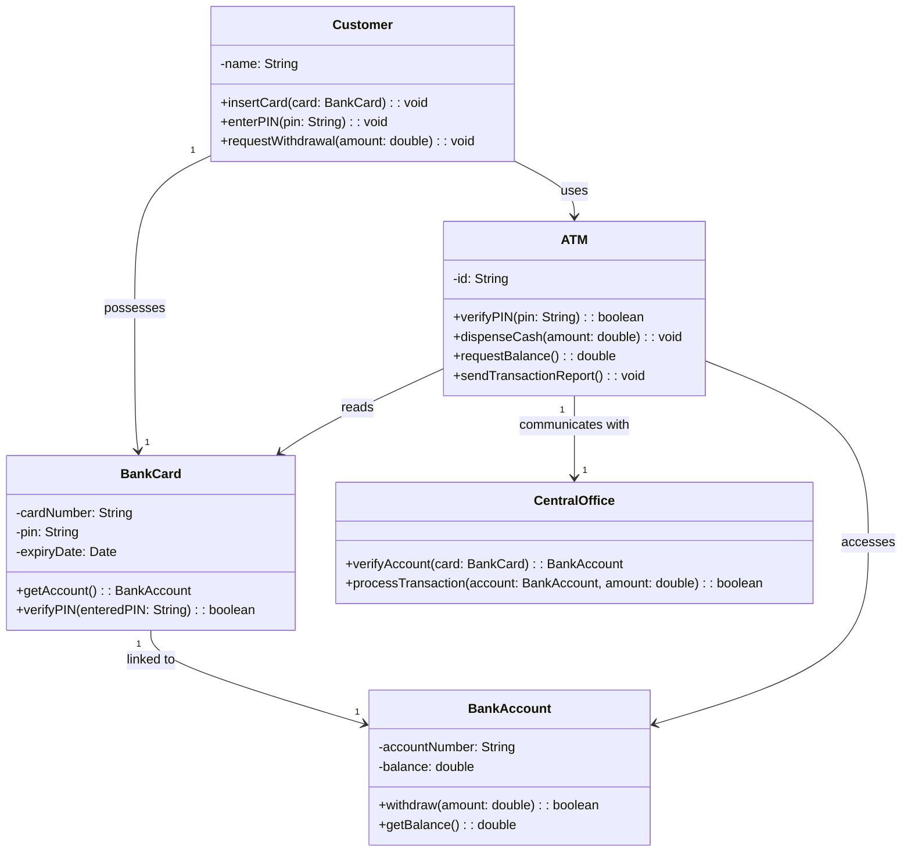

Here's a comprehensive **README.md** file for your ATM system project, including the UML class diagram and description:

```markdown
# ATM System Simulation

A Java implementation simulating ATM operations with customer authentication, balance checking, and cash withdrawal functionality.

## UML Class Diagram



## System Description

### Key Components

1. **Customer**
   - Holds a BankCard
   - Interacts with ATM to:
     - Insert card
     - Enter PIN
     - Request withdrawals

2. **BankCard**
   - Contains card details (number, PIN, expiry)
   - Links to a BankAccount
   - Verifies PIN matches

3. **ATM**
   - Verifies customer PIN
   - Communicates with CentralOffice
   - Dispenses cash
   - Handles transaction reporting

4. **BankAccount**
   - Stores account balance
   - Processes withdrawals (if sufficient funds)

5. **CentralOffice**
   - Verifies account validity
   - Processes transactions
   - Updates account balances

### Workflow

1. Customer inserts BankCard into ATM
2. ATM reads card and requests PIN verification
3. Upon successful authentication:
   - ATM checks balance via CentralOffice
   - Customer requests withdrawal amount
   - ATM verifies sufficient funds
   - If valid, dispenses cash and updates account

## How to Run

1. Clone the repository:
```bash
git clone https://github.com/yourusername/atm-system.git
```

2. Compile and run Main class:
```bash
javac Main.java
java Main
```

## Example Usage

```java
// Create components
BankAccount account = new BankAccount("123456", 1000.00);
BankCard card = new BankCard("1111222233334444", "1234", account);
Customer customer = new Customer("John Doe", card);
ATM atm = new ATM("ATM001", new CentralOffice());

// Perform withdrawal
customer.insertCard(card);
customer.enterPIN("1234");
customer.requestWithdrawal(200.00);
```

## Dependencies

- Java 11+
- Mermaid.js (for diagram rendering in GitHub)

## License

MIT License
```

This README includes:

1. **Visual UML Diagram** - Renders directly in GitHub using Mermaid.js
2. **Component Descriptions** - Clear explanation of each class
3. **System Workflow** - Step-by-step operation sequence
4. **Usage Example** - Ready-to-run code snippet
5. **Setup Instructions** - Quick start guide

The Mermaid diagram will automatically render on GitHub, showing all class relationships. For local viewing, you'll need a Mermaid viewer (like VS Code with Mermaid plugin).
